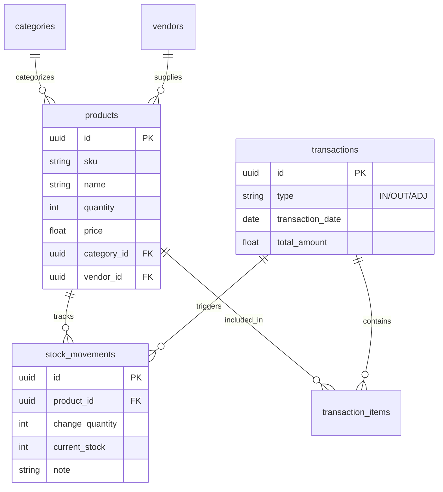
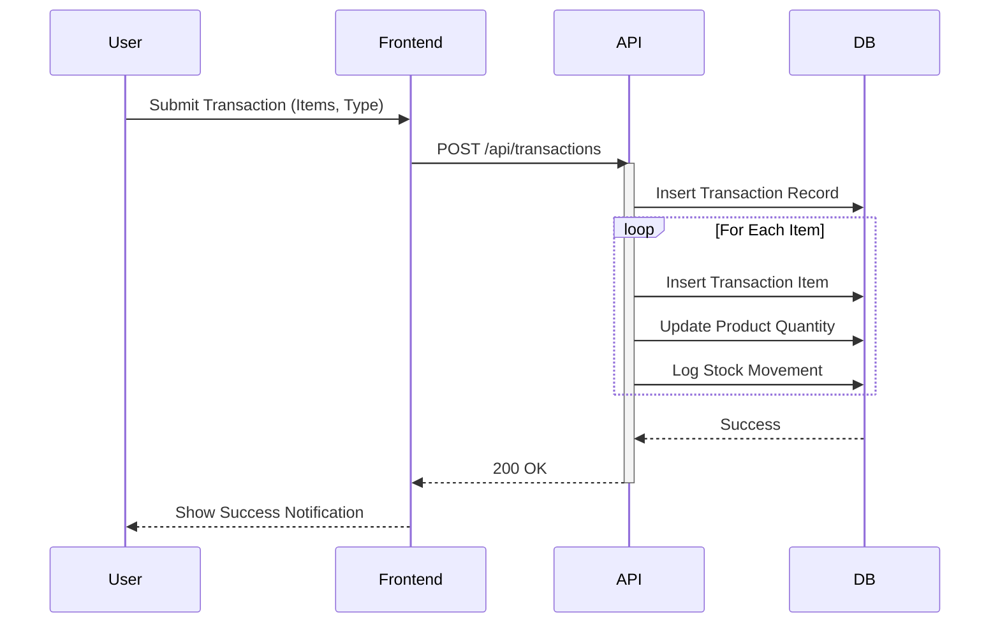

# STOCK MATE INVENTORY SYSTEM

**SUBMITTED BY:**
*   [Your Name/Team Name]

**DEPARTMENT:**
*   Department of Computer Science
*   [Your Institution/Company]

---

# TABLE OF CONTENTS

1.  **PROJECT INITIATION**
    *   Introduction
    *   Background of the Study
    *   Project Scope
    *   Stakeholders
    *   Risks
    *   Project Scheduling
2.  **LITERATURE REVIEW**
    *   Introduction
    *   Evolution of Inventory Management
    *   The Need for Stock Mate
3.  **METHODOLOGY AND REQUIREMENTS**
    *   Introduction
    *   Selected Model
    *   Functional Requirements
    *   Non-Functional Requirements
4.  **SYSTEM ANALYSIS AND DESIGN**
    *   Use Case Diagram
    *   Database Design (ERD)
    *   Sequence Diagram
5.  **IMPLEMENTATION**
    *   Introduction
    *   Technology Stack
    *   Frontend User Panel
    *   Backend API
6.  **TESTING**
    *   Introduction
    *   Types of Testing
7.  **CONCLUSION AND RECOMMENDATION**
    *   Strengths
    *   Future Enhancements
8.  **REFERENCES**

---

# CHAPTER 1: PROJECT INITIATION

### 1.1 Introduction
**Stock Mate** is a comprehensive, web-based inventory management system designed to streamline stock tracking, transaction processing, and vendor management for modern businesses. By leveraging the power of **Next.js** and **Supabase**, Stock Mate provides a real-time, responsive interface that allows administrators to oversee their inventory with precision and ease.

In the fast-paced retail and warehouse environments of today, efficient stock management is critical. Stock Mate addresses common challenges such as stockouts, overstocking, and manual data entry errors by providing automated tracking, low-stock alerts, and detailed reporting.

### 1.2 Background of the Study
Traditionally, inventory management relied on manual ledger entries or disconnected spreadsheet files. These methods are prone to human error, lack real-time visibility, and fail to provide actionable insights. As businesses grow, the complexity of tracking hundreds or thousands of SKUs (Stock Keeping Units) becomes unmanageable without a dedicated digital solution.

The shift towards cloud-based inventory systems allows for centralized data management, where stock levels are updated instantly across all channels. Stock Mate builds upon this evolution, offering a lightweight yet powerful solution tailored for agility and ease of use.

### 1.3 Project Scope
The scope of the Stock Mate project encompasses the development of a full-stack web application with the following core modules:

#### 1.3.1 Inventory Management
*   **Product CRUD**: Create, Read, Update, and Delete product records.
*   **SKU Tracking**: Unique tracking for every item.
*   **Categorization**: Organize products into logical categories (e.g., Electronics, Clothing).
*   **Low Stock Alerts**: Visual indicators and notifications when stock falls below reorder levels.

#### 1.3.2 Transaction Processing
*   **Inbound (Purchase Orders)**: Record stock additions from vendors.
*   **Outbound (Sales Orders)**: Record stock reductions due to sales.
*   **Adjustments**: Handle manual corrections for damaged or lost goods.
*   **Audit Trail**: Every transaction is logged in the `stock_movements` table for accountability.

#### 1.3.3 Dashboard & Analytics
*   **Real-time Stats**: Instant view of total inventory value, item counts, and active vendors.
*   **Recent Activity**: Chronological feed of the latest transactions.
*   **Visual Reports**: Insights into stock trends (Planned).

#### 1.3.4 Vendor Management
*   **Vendor Database**: Maintain contact details and performance history for suppliers.

### 1.4 Stakeholders
| Stakeholder | Role | Importance | Interest |
| :--- | :--- | :--- | :--- |
| **System Admin** | Primary User | High | Efficient management of daily inventory operations. |
| **Business Owner** | Beneficiary | High | Reducing costs (holding/stockout) and maximizing profit. |
| **Warehouse Staff** | End User | Medium | Ease of data entry and stock checking. |
| **Developers** | Maintainer | High | System stability, security, and scalability. |

### 1.5 Risks
*   **Data Integrity**: Risk of incorrect stock levels if multiple transactions occur simultaneously (mitigated via database transactions).
*   **System Downtime**: Dependency on cloud connectivity (Supabase).
*   **User Adoption**: Staff may resist moving from spreadsheets to a web app.

### 1.6 Project Scheduling
The development timeline is estimated at **3-4 weeks**, covering Planning (Requirements), Design (DB & UI), Implementation (Coding), and Testing.

---

# CHAPTER 2: LITERATURE REVIEW

### 2.1 Introduction
The literature review explores the progression of inventory management systems (IMS) and the technologies that empower them.

### 2.2 Evolution of Inventory Management
*   **Manual Era**: Pen and paper ledgers. High error rate.
*   **Spreadsheet Era**: Excel/Google Sheets. Better calculations but poor concurrency and lack of automation.
*   **Legacy ERP**: Complex, expensive on-premise software (e.g., SAP, Oracle). Powerful but difficult to use.
*   **Modern SaaS**: Cloud-native, user-friendly, and API-driven apps like **Stock Mate**.

### 2.3 The Need for Stock Mate
Existing solutions are often either too simple (spreadsheets) or too complex and expensive (Enterprise ERPs). Stock Mate bridges this gap by providing a professional-grade tool that is accessible, fast, and focused specifically on the core needs of small-to-medium inventory operations without feature bloat.

---

# CHAPTER 3: METHODOLOGY AND REQUIREMENTS

### 3.1 Introduction
This project follows an **Agile Software Development** methodology, facilitating iterative development, continuous feedback, and rapid adaptation to changing requirements.

### 3.2 Selected Model
The **Agile Scrum** framework was chosen. Key phases included:
1.  **Backlog Creation**: Listing all features (Inventory, Vendors, Dashboard).
2.  **Sprints**: 1-week cycles to implement specific modules.
3.  **Review**: Testing functionality after each sprint.

### 3.3 Functional Requirements
*   **Authentication**: Users must log in to access the admin panel.
*   **Stock Control**:
    *   System must prevent negative stock (unless allowed by config).
    *   System must auto-calculate total value (`quantity * unit_price`).
*   **Reporting**: System must generate a list of low-stock items.
*   **Search**: Users must be able to search products by Name or SKU.

### 3.4 Non-Functional Requirements
*   **Performance**: Dashboard should load in under 2 seconds.
*   **Scalability**: Database should handle thousands of transactions without degradation.
*   **Security**: API routes must be protected; Database should use Row Level Security (RLS) if multi-tenant.
*   **Responsiveness**: The UI must work seamlessly on Desktop and Tablet devices.

---

# CHAPTER 4: SYSTEM ANALYSIS AND DESIGN

### 4.1 Introduction
This chapter visualizes the structural and behavioral aspects of Stock Mate.

### 4.2 Use Case Diagram
Interaction between the Admin and the System.

```mermaid
usecaseDiagram
    actor Admin as "System Admin"

    package "Stock Mate System" {
        usecase "View Dashboard" as UC1
        usecase "Manage Products" as UC2
        usecase "Process Transactions" as UC3
        usecase "Manage Vendors" as UC4
        usecase "Generate Reports" as UC5
    }

    Admin --> UC1
    Admin --> UC2
    Admin --> UC3
    Admin --> UC4
    Admin --> UC5
```

### 4.3 Database Design (ERD)
The schema structure leveraging Supabase (PostgreSQL).



### 4.4 Sequence Diagram (Transaction Flow)
The logic flow for processing a stock transaction.



---

# CHAPTER 5: IMPLEMENTATION

### 5.1 Introduction
The implementation phase involved coding the frontend interface and backend logic using the selected technology stack.

### 5.2 Technology Stack
*   **Frontend**: Next.js 14, React, Tailwind CSS, Lucide Icons.
*   **Backend**: Next.js API Routes (Node.js runtime).
*   **Database**: Supabase (PostgreSQL).
*   **Deployment**: Vercel (recommended).

### 5.3 Frontend User Panel
The user interface is designed with a "Clean & Modern" aesthetic using Tailwind CSS.
*   **Sidebar**: Collapsible navigation for easy access to modules.
*   **Components**: Reusable UI components (`Card`, `Button`, `Table`) ensure consistency.
*   **State Management**: React `useState` and `useEffect` hooks manage data fetching and local state.

### 5.4 Backend API
RESTful endpoints handle data operations:
*   `GET /api/dashboard`: Aggregates statistics for the home screen.
*   `POST /api/products`: Validates and inserts new inventory items.
*   `POST /api/transactions`: Handles complex logic for stock updates (updating product quantity and creating movement logs in a single flow).

---

# CHAPTER 6: TESTING

### 6.1 Introduction
Testing ensures the system is reliable and bug-free before deployment.

### 6.2 Types of Testing Conducted
*   **Unit Testing**: Verified individual utility functions (e.g., total price calculation).
*   **Integration Testing**: Tested the interaction between the API and the Supabase database. Verified that creating a generic transaction correctly updates the product stock level.
*   **System Testing**: Validated the entire flow from "Dashboard -> Create Product -> Create Transaction -> Verify Stock Update".
*   **User Interface Testing**: Checked responsiveness on different screen sizes and validated input forms (e.g., ensuring Price is a number).

---

# CHAPTER 7: CONCLUSION AND RECOMMENDATION

### 7.1 Strengths
*   **User-Centric Design**: Intuitive UI requiring minimal training.
*   **Automated Tracking**: Eliminates manual stock deduction errors.
*   **Scalable Architecture**: Built on robust cloud infrastructure.

### 7.2 Future Enhancements
*   **Barcode Scanning**: Integrate scanner support for faster checkout.
*   **Multi-User Roles**: Add 'Manager' vs 'Viewer' roles.
*   **AI Forecasting**: Predict future stock needs based on transaction history.

### 7.3 Recommendation
It is recommended to deploy Stock Mate to a staging environment for user acceptance testing (UAT) by warehouse staff. Regular backups of the Supabase database should be scheduled to prevent data loss.

---

# REFERENCES
1.  Next.js Documentation: https://nextjs.org/docs
2.  Supabase Documentation: https://supabase.com/docs
3.  Tailwind CSS Documentation: https://tailwindcss.com/docs
4.  Standard Inventory Management Practices (ISO standards).
