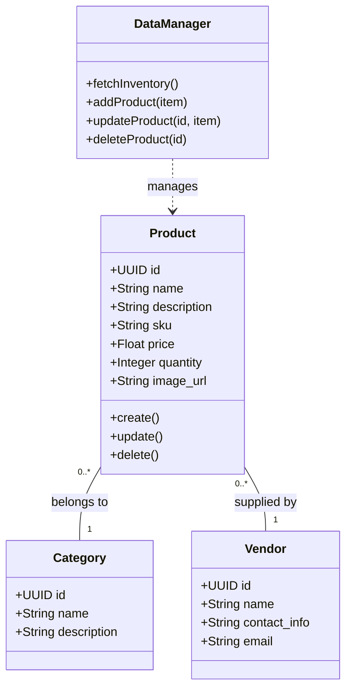
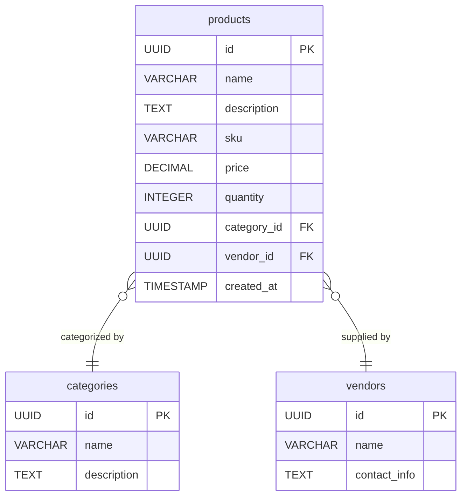
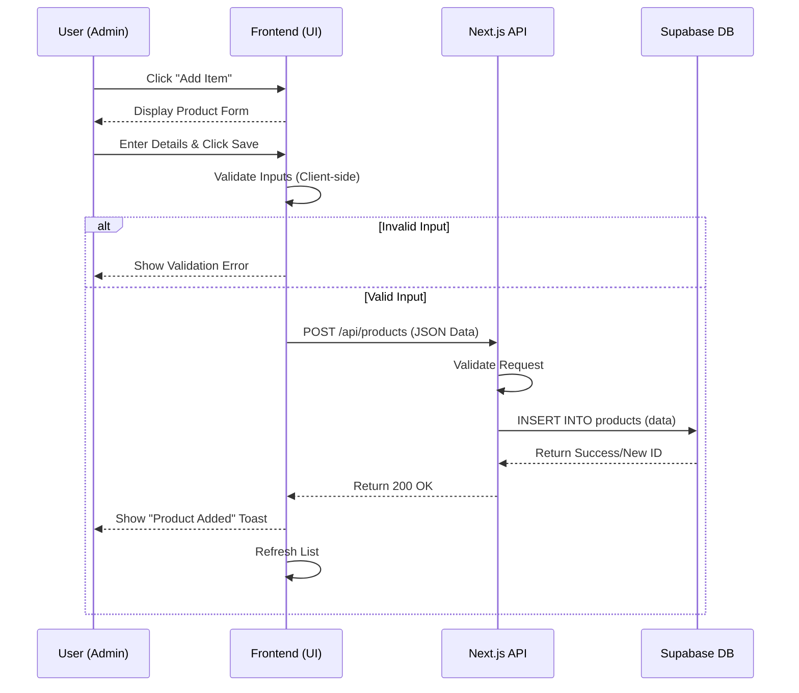

# 4. SYSTEM DESIGN AND DIAGRAMS

## 4.1 Use Case Diagram

The Use Case diagram visualizes the interaction between the system's primary actor (Admin) and the functional modules of the Stock Mate Inventory System. It defines the scope of the system and identifies the key services provided.

```mermaid
usecaseDiagram
    actor Admin
    
    package "Stock Mate System" {
        usecase "Login / Authentication" as UC1
        usecase "Manage Inventory" as UC2
        usecase "Manage Categories" as UC3
        usecase "Manage Vendors" as UC4
        usecase "View Dashboard & Reports" as UC5
        usecase "Add Product" as UC2a
        usecase "Edit/Delete Product" as UC2b
    }

    Admin --> UC1
    Admin --> UC2
    Admin --> UC3
    Admin --> UC4
    Admin --> UC5
    
    UC2 .> UC2a : include
    UC2 .> UC2b : include
```

### 4.1.1 Use Case Descriptions

The following tables describe the primary use cases in detail.

**Table 4.1: Use Case – Login**

| Field | Description |
| :--- | :--- |
| **Use Case ID** | UC-01 |
| **Use Case Name** | Login |
| **Primary Actor** | Admin |
| **Pre-conditions** | • System must be online.<br>• Admin must have valid credentials registered in Supabase. |
| **Main Flow** | 1. Admin navigates to the Login Page.<br>2. Admin enters Email and Password.<br>3. System validates credentials with Supabase Auth.<br>4. System grants access and redirects to the Dashboard. |
| **Post-conditions** | Admin is authenticated and session is active. |
| **Alternative Flow** | **Invalid Credentials**: System displays an error message ("Invalid login details") and prompts retry. |

**Table 4.2: Use Case – Add Product**

| Field | Description |
| :--- | :--- |
| **Use Case ID** | UC-02 |
| **Use Case Name** | Add Product |
| **Primary Actor** | Admin |
| **Pre-conditions** | Admin is logged in. |
| **Main Flow** | 1. Admin navigates to the Inventory Page.<br>2. Admin clicks "Add Item".<br>3. System displays the "Add New Product" form.<br>4. Admin fills details (Name, SKU, Price, Quantity, Category, Vendor).<br>5. Admin saves the entry.<br>6. System validates input and updates the Database. |
| **Post-conditions** | New product appears in the Inventory list and stock count increases. |
| **Alternative Flow** | **Missing Fields**: System explicitly highlights mandatory fields (e.g., Name, Price) and prevents submission. |

**Table 4.3: Use Case – Manage Vendors**

| Field | Description |
| :--- | :--- |
| **Use Case ID** | UC-03 |
| **Use Case Name** | Manage Vendors |
| **Primary Actor** | Admin |
| **Pre-conditions** | Admin is logged in. |
| **Main Flow** | 1. Admin selects the "Vendors" tab.<br>2. Admin views list of existing suppliers.<br>3. Admin can Add, Edit, or Delete vendor details.<br>4. System updates the `vendors` table accordingly. |
| **Post-conditions** | Vendor list is current; products can be linked to new vendors. |

---

## 4.2 Activity Diagram

This diagram visualizes the workflow for adding a new product to the inventory, detailing the sequential steps and decision points.

```mermaid
flowchart TD
    Start((Start)) --> Login[Admin Logs In]
    Login --> Dashboard[View Dashboard]
    Dashboard --> InventoryPage[Navigate to Inventory]
    InventoryPage --> ClickAdd[Click 'Add Item' Button]
    ClickAdd --> FillForm[Fill Product Details\n(Name, SKU, Price, Qty)]
    FillForm --> Validation{Valid Data?}
    
    Validation -- No --> ShowError[Show Error Message]
    ShowError --> FillForm
    
    Validation -- Yes --> SaveDB[Save to Supabase Database]
    SaveDB --> Success{Success?}
    
    Success -- No --> APIError[Display API Error]
    APIError --> FillForm
    
    Success -- Yes --> UpdateUI[Update Inventory List]
    UpdateUI --> End((End))
```

---

## 4.3 Class Diagram

The Class Diagram represents the static structure of the system, showing the key classes (data entities), their attributes, and their relationships.



---

## 4.4 Entity Relationship Diagram (ERD)

The ERD illustrates the logical database structure implemented in Supabase (PostgreSQL), highlighting the tables and the relationships between them.



---

## 4.5 Sequence Diagram

This diagrams shows the object interactions and message sequence for the "Add Product" process, from the User Interface to the Database.



---

## 4.6 AI Generation Prompts

If you wish to generate high-fidelity visual versions of these charts using generative AI tools (like ChatGPT Plus with DALL-E 3, Midjourney, or specialized diagramming AIs), you can use the following prompts.

**For Use Case Diagram:**
> "Create a professional UML Use Case Diagram for the 'Stock Mate' Inventory System. 
> **Actor**: 'Admin' (stick figure on left).
> **System Boundary**: Large rectangle labeled 'Stock Mate System'.
> **Use Cases (Ovals)** inside boundary, all connected to Admin:
> 1. **Login / Authenticate** (Secure access via Supabase).
> 2. **View Dashboard** (See total stock, low stock alerts, value).
> 3. **Manage Products** (General bubble) -> Include relationships (dashed lines) to 'Add Product', 'Edit Product', 'Delete Product'.
> 4. **Manage Categories** (Create and list categories).
> 5. **Manage Vendors** (Supplier details).
> 6. **Search & Filter Inventory** (Find items by SKU/Name).
> **Style**: High-quality technical diagram, clean lines, white background, blue accent colors for ovals, professional font."

**For Activity Diagram (Add Product):**
> "Generate a vertical flowchart Activity Diagram showing the process of adding a product to an inventory system. Steps: Start -> Login -> Navigate to Inventory -> Click Add -> Fill Form -> Validate Data (Decision Node) -> Save to Database -> Update List -> End. Style: Modern UI flow, minimal lines, pastel colors."

**For Class Diagram:**
> "Create a UML Class Diagram for an Inventory System. Classes: Product (id, name, sku, price, qty), Category (id, name), Vendor (id, name, contact). Relationships: Product belongs to one Category; Product is supplied by one Vendor. Style: Technical architectural sketch, high contrast."

**For ERD:**
> "Draw an Entity Relationship Diagram (ERD) for a stock system. Tables: Products, Categories, Vendors. Show One-to-Many relationships from Categories to Products and Vendors to Products. Attributes: PK (UUID) and standard fields. Style: Database schema visualization, clean lines."
